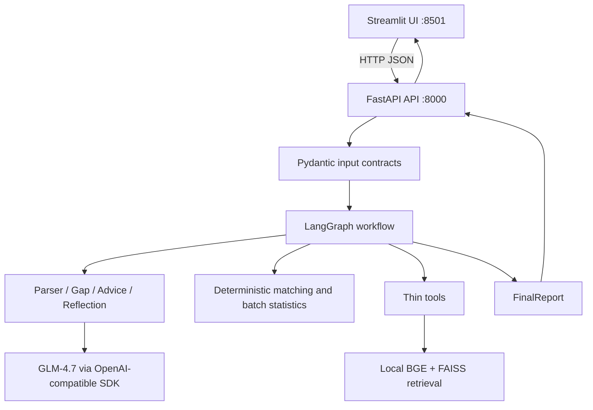

# JobPilot v1.0 Architecture

The UI only collects input and renders `FinalReport`. Parsing, matching, scoring,
grounding, retrieval, and reflection remain in the backend. Python owns all
deterministic calculations; the LLM extracts structured data and requests the
bounded retrieval tool when the selected job has skill gaps.

The API service lazily constructs shared model and workflow dependencies. Each
request creates a fresh `JobPilotState`, so candidate, job, and report data do
not cross request boundaries. `/health` is transport-only and does not load a
model or the vector index.

The v1.0 boundary excludes crawling, automatic applications, email actions,
persistent human-in-the-loop, queues, authentication, and multi-agent
orchestration. Those are Future Work and are not required to run this demo.
